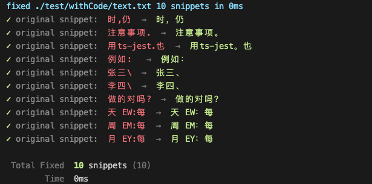

# fixdot
A command-line tool that fixes English punctuation in Chinese sentences

If you change the input method punctuation to English punctuation, but you don’t want to switch back and forth every time you enter Chinese. Or you want to correct punctuation errors in a Chinese article, etc. All these, this command line tool can help you

`fixdot <file path>` use the right punctuation

TIP: file path support pattern match, like: `*/*.js`


## install
Ensure you have Node.js version 12.20+ installed. Then run the following:
```bash
npm i -g fixdot
# or yarn
yarn global add fixdot
# or pnpm
pnpm i -g fixdot
```

## Usage
```txt
Usage: fixDot [options] [letters...]

Fix english punctuation to chinese punctuation for in Chinese sentences

Options:
  -v, --version  output the current version
  -p --preview   only preview incorrect snippets, will not auto write to the file
  -d --detail    show incorrect snippets
  -h, --help     display help for command
```