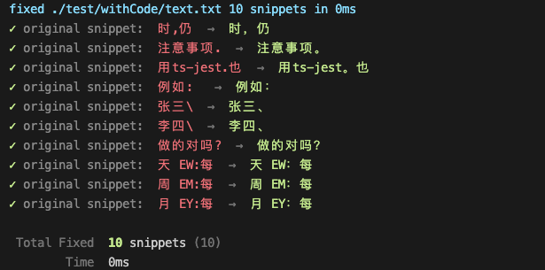

# fixdot
一个修复中文语句中使用了英文标点的命令行小工具

如果你把输入法标点改成了英文标点，又不想每次输入中文是来回切换。又或者你想纠正一篇中文文章中的不小心输入的英文标点等等。这些，这个命令行tool都可以帮你搞定

通过 `fixdot <file path>` 修复文件中的标点

TIP file path 支持模式匹配，例如：`*/*.js`


## install
请先确保你安装了 Node.js 12.20+ 版本，然后再运行下面的命令
```bash
npm i -g fixdot
# or yarn
yarn global add fixdot
# or pnpm
pnpm i -g fixdot
```

## Usage
```txt
Usage: fixDot [options] [letters...]

Fix english punctuation to chinese punctuation for in Chinese sentences

Options:
  -v, --version  output the current version
  -p --preview   only preview incorrect snippets, will not auto write to the file
  -d --detail    show incorrect snippets
  -h, --help     display help for command
```